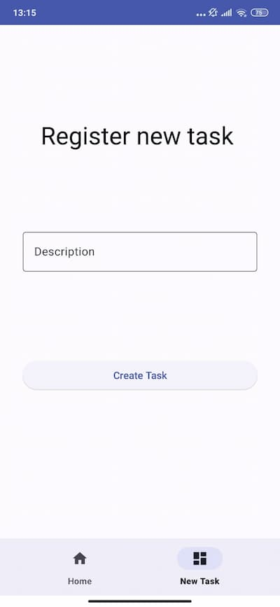
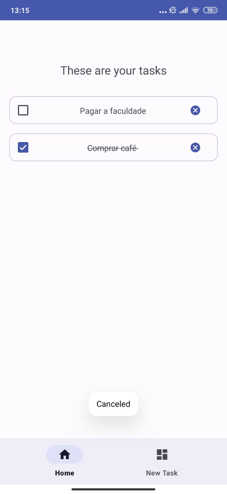
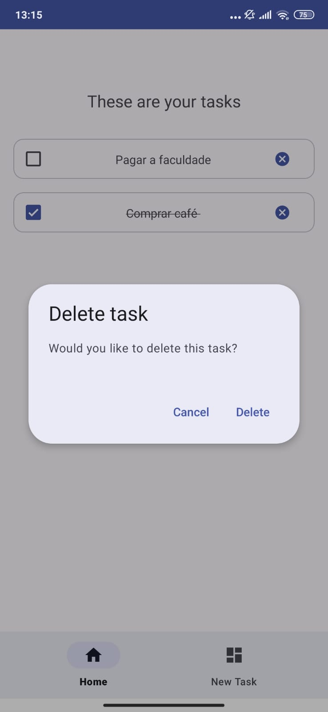
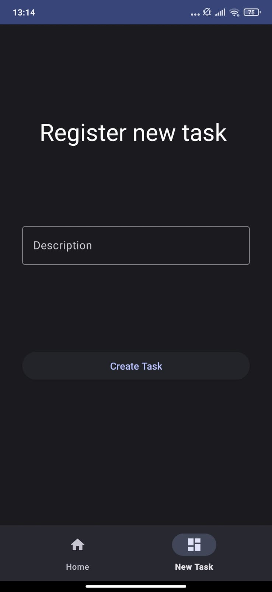
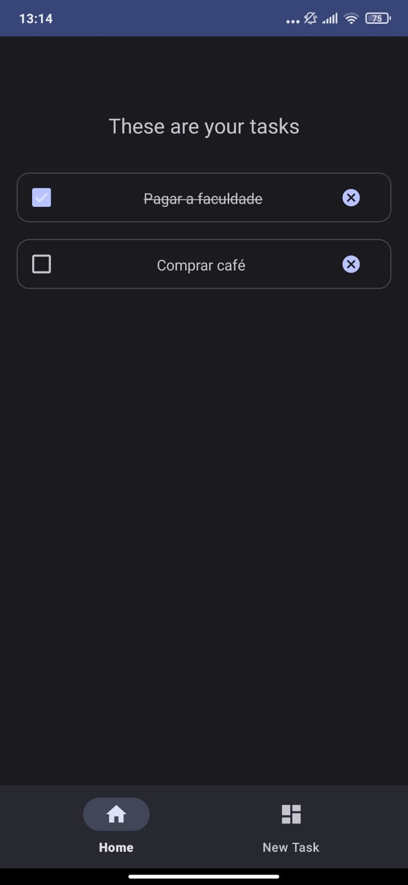
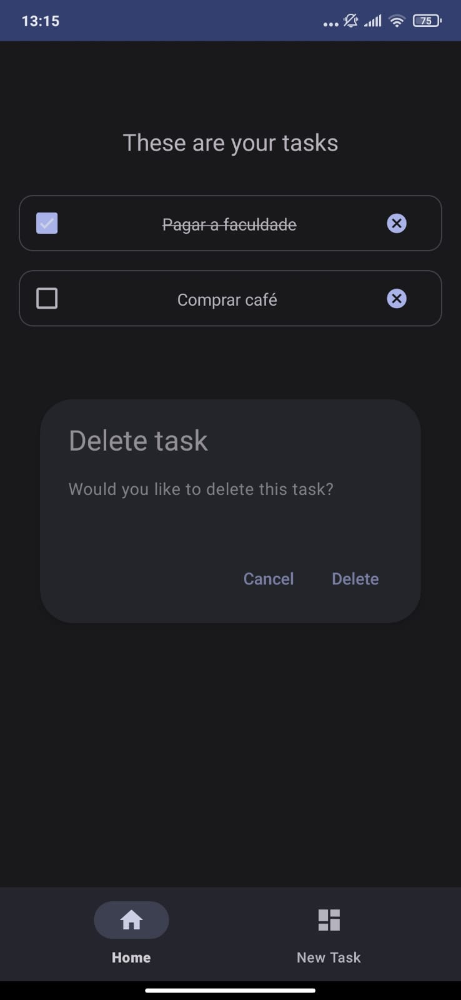

# To Do App

## Um aplicativo simples, mas elegante, para organizar tarefas.

Este é um aplicativo feito com o principal propósito de demonstrar minhas habilidades desenvolvidas
ao longo dos meus estudos de desenvolvimento Android.

## Destaques

- Uso de componentes visuais com o [Material design 3](https://m3.material.io/)
- Uso de componentes de listagem como o  recycler view
- Implementação do banco de dados SQLite
- Conceitos de arquitetura MVVM

## Instalação
Você pode baixar o app neste [link](https://github.com/TMendes-lucca/Todoapp/releases/tag/1.0)
Basta seguir os passos da instalação e conceder as permissões conforme solicitadas.

## Capturas de Tela

### Tema Claro

 

### Tema Escuro

